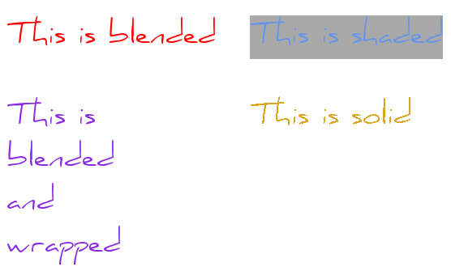

basic_renderer
==============

The ``basic_renderer`` provides the interface for hardware-accelerated 2D rendering. The aliases ``renderer`` and 
``renderer_handle`` represent owning and non-owning renderers respectively.

The owning renderer has an extended interface to support automatic viewport translation and font handling.

General information
-------------------

======================  =========================================
  Property               Value
----------------------  -----------------------------------------
Default constructible    No
Copyable                 Only ``renderer_handle``
Movable                  Yes
Implicit conversions     None
Explicit conversions     None
Namespace                ``::cen``
Header                   ``renderer.hpp``
======================  =========================================

Interface 
---------

.. doxygenclass:: cen::basic_renderer
  :members: 
  :undoc-members:
  :outline:
  :no-link:

Examples
--------

Text rendering
~~~~~~~~~~~~~~

Three different text encodings are supported: UTF-8, Latin-1 and Unicode. Each of these
encodings can be rendered in four different styles: "blended", "shaded", "solid" and 
"blended and wrapped". The following image displays a piece of text rendered with the 
various options.

* **Blended**: The best looking option but also the slowest. Uses anti-aliasing.
* **Blended and wrapped**: Same as blended, but the text will be wrapped to fit a specified width.
* **Solid**: The fastest option. Doesn't use anti-aliasing so it will look a bit harsh.
* **Shaded**: The same as blended, but with a colored rectangle behind it.

All of the text rendering functions feature the same names except for a distinguishing suffix,
i.e. ``_utf8``, ``_latin1`` or ``_unicode``.

.. code-block:: c++
  
  #include <renderer.hpp>
   
  void demo(cen::renderer& renderer, cen::font& font)
  {
    renderer.set_color(cen::colors::white);

    auto blended = renderer.render_blended_utf8("Never", font);
    auto wrapped = renderer.render_blended_wrapped_utf8("Gonna", 100, font);
    auto shaded = renderer.render_shaded_utf8("Give", cen::colors::pink, font);
    auto solid = renderer.render_solid_utf8("You", font);
  }

Typical rendering method
~~~~~~~~~~~~~~~~~~~~~~~~

The following example illustrates how a typical rendering method looks like using 
the renderer.

.. code-block:: c++
  
  #include <renderer.hpp>

  void draw(cen::renderer& renderer)
  {
    renderer.clear_with(cen::colors::black); // clear rendering target

    // Miscellaneous rendering calls...

    renderer.present(); // apply the rendering operations to the target
  }  

Font handling
~~~~~~~~~~~~~

As previously mentioned, the ``renderer`` class provides storage of ``font`` instances. The
following example demonstrates most of the functions available for font handling.

.. code-block:: c++
  
  #include <renderer.hpp>

  void font_demo(cen::renderer& renderer)
  {
    constexpr auto id = 7;
    if (renderer.has_font(id)) {
      renderer.remove_font(id);
    } else {
      renderer.emplace_font(id, "comic_sans.ttf", 12);
      auto& font = renderer.get_font(id);
    }
  }

Use case for ``renderer_handle``
~~~~~~~~~~~~~~~~~~~~~~~~~~~~~~~~

The following example demonstrates how ``renderer_handle`` can be used to enable use of the 
Centurion rendering API, without actually claiming ownership. The example assumes that
you, for some reason, can't change the signature of a function that takes a ``SDL_Renderer*``
parameter.

.. note::

  It's very cheap to create an instance of ``renderer_handle``, it's just a copy of a pointer!

.. code-block:: c++

  #include <renderer.hpp>

  void draw(SDL_Renderer* renderer)
  {
    cen::renderer_handle handle{renderer};

    handle.clear_with(cen::colors::black);

    handle.set_color(cen::colors::pink);
    handle.fill_rect(cen::irect{{15, 20}, {100, 100}});
 
    handle.present();
  }
